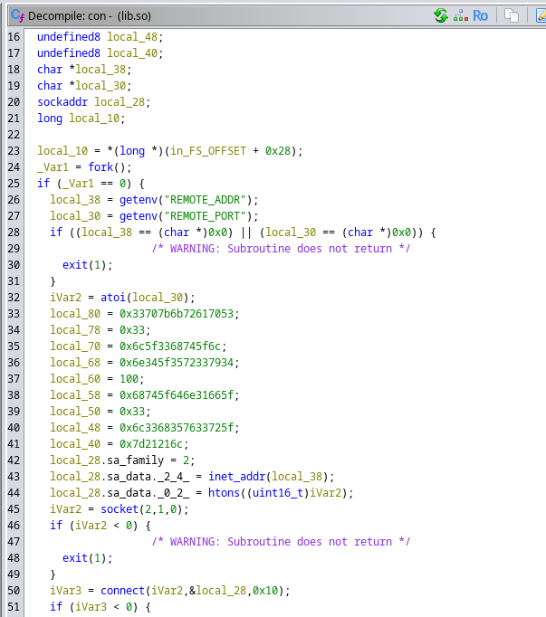
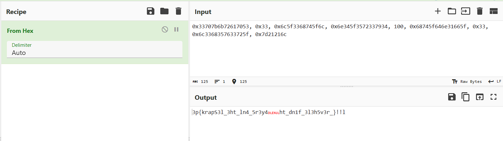

# Challenge Name: Potato Peeler
## Category: Digital Forensics

## Description

Something strange was getting installed when I was setting up my docker container, can you find out what it is ?

**granolah/potatopeeler**
  
---
## Approach

For this challenge, you were given a Dockerfile and a docker image reference :

```
➜  /home/kakarot/RamadhanCTF/foren/potato peeler  cat Dockerfile    
# Base image (using Ubuntu)
FROM ubuntu:latest

# Install necessary tools (optional, for analysis inside the container)
RUN apt update && apt install -y file tar

# Copy the shared library into the container
COPY lib.so /usr/lib/lib.so

# Set working directory
WORKDIR /usr/lib

# Provide a hint for players
CMD echo "it's easier than you think"
```

## Solution : 

The first thing you'll need to do is pull that docker image to start the analysis :

```bash
➜  /home/kakarot/RamadhanCTF/foren/potato peeler  docker pull granolah/potatopeeler
Using default tag: latest
latest: Pulling from granolah/potatopeeler
5a7813e071bf: Pull complete 
37c3bb217fa3: Pull complete 
b0485ee0bf62: Pull complete 
Digest: sha256:c6c5ade47f2d56fd7cbb2f34a3f05f41a7425243ff765e5e755ed76a0e3156f6
Status: Downloaded newer image for granolah/potatopeeler:latest
docker.io/granolah/potatopeeler:latest
```

Then you need to save the image so you can inspect it's layers :

```bash
➜  /home/kakarot/RamadhanCTF/foren/potato peeler  docker image save granolah/potatopeeler -o image.tar
➜  /home/kakarot/RamadhanCTF/foren/potato peeler  file image.tar
image.tar: POSIX tar archive
➜  /home/kakarot/RamadhanCTF/foren/potato peeler  7z l image.tar 

7-Zip 24.09 (x64) : Copyright (c) 1999-2024 Igor Pavlov : 2024-11-29
 64-bit locale=en_US.UTF-8 Threads:128 OPEN_MAX:1024, ASM

Scanning the drive for archives:
1 file, 135912960 bytes (130 MiB)

Listing archive: image.tar

--
Path = image.tar
Type = tar
Physical Size = 135912960
Headers Size = 8192
Code Page = UTF-8
Characteristics = POSIX ASCII

   Date      Time    Attr         Size   Compressed  Name
------------------- ----- ------------ ------------  ------------------------
2025-03-07 16:24:12 D....            0            0  blobs
2025-03-30 15:51:54 D....            0            0  blobs/sha256
1970-01-01 01:00:00 .....          707         1024  blobs/sha256/05b8459f2562b41ed7dd6b885f264ce5b9addd4438b86010c0ef304751484915
2025-03-07 16:24:12 .....         1500         1536  blobs/sha256/0b933d095bf836d2ac496734004e9aff0ee4bd8e1fe3388c39e8f94603f61802
2025-03-07 16:24:12 .....          406          512  blobs/sha256/14f4f0f0e603c2d8e5a5406d1ae6fa04e328b6e1ac5ffbcb6e5b81667b3c54aa
2025-03-07 16:24:12 .....          482          512  blobs/sha256/3f2fdfb33de39bbf1a610b54e3391827af3a4f74ecca371eaf526376833d21bf
2025-03-07 16:24:12 .....     80645120     80645120  blobs/sha256/4b7c01ed0534d4f9be9cf97d068da1598c6c20b26cb6134fad066defdb6d541d
2025-03-07 16:24:12 .....         2996         3072  blobs/sha256/60c00a79343289d680bfb39216e6667c19f72b8b48ee23d1ec406acbc2f764c3
2025-03-07 16:24:12 .....        18432        18432  blobs/sha256/7e0cea4d5af46e69d84f01dcf9233387f2538fb45040c0125bb47fea4b8f4a9b
2025-03-07 16:24:12 .....     55231488     55231488  blobs/sha256/c8f7094d483f1bda2461b62a68292c6ea0a84bd8a82598ec9c90c687db7c1634
1970-01-01 01:00:00 .....          369          512  index.json
1970-01-01 01:00:00 .....         1086         1536  manifest.json
1970-01-01 01:00:00 .....           31          512  oci-layout
1970-01-01 01:00:00 .....          104          512  repositories
------------------- ----- ------------ ------------  ------------------------
2025-03-30 15:51:54          135902721    135904768  12 files, 2 folders
```

After unzipping the archive, we'll find more tar archives :

```bash
➜  /home/kakarot/RamadhanCTF/foren/potato peeler/image  tar xvf image.tar
blobs/
blobs/sha256/
blobs/sha256/05b8459f2562b41ed7dd6b885f264ce5b9addd4438b86010c0ef304751484915
blobs/sha256/0b933d095bf836d2ac496734004e9aff0ee4bd8e1fe3388c39e8f94603f61802
blobs/sha256/14f4f0f0e603c2d8e5a5406d1ae6fa04e328b6e1ac5ffbcb6e5b81667b3c54aa
blobs/sha256/3f2fdfb33de39bbf1a610b54e3391827af3a4f74ecca371eaf526376833d21bf
blobs/sha256/4b7c01ed0534d4f9be9cf97d068da1598c6c20b26cb6134fad066defdb6d541d
blobs/sha256/60c00a79343289d680bfb39216e6667c19f72b8b48ee23d1ec406acbc2f764c3
blobs/sha256/7e0cea4d5af46e69d84f01dcf9233387f2538fb45040c0125bb47fea4b8f4a9b
blobs/sha256/c8f7094d483f1bda2461b62a68292c6ea0a84bd8a82598ec9c90c687db7c1634
index.json
manifest.json
oci-layout
repositories
➜  /home/kakarot/RamadhanCTF/foren/potato peeler/image  file blobs/sha256/*
blobs/sha256/05b8459f2562b41ed7dd6b885f264ce5b9addd4438b86010c0ef304751484915: JSON text data
blobs/sha256/0b933d095bf836d2ac496734004e9aff0ee4bd8e1fe3388c39e8f94603f61802: JSON text data
blobs/sha256/14f4f0f0e603c2d8e5a5406d1ae6fa04e328b6e1ac5ffbcb6e5b81667b3c54aa: JSON text data
blobs/sha256/3f2fdfb33de39bbf1a610b54e3391827af3a4f74ecca371eaf526376833d21bf: JSON text data
blobs/sha256/4b7c01ed0534d4f9be9cf97d068da1598c6c20b26cb6134fad066defdb6d541d: POSIX tar archive
blobs/sha256/60c00a79343289d680bfb39216e6667c19f72b8b48ee23d1ec406acbc2f764c3: JSON text data
blobs/sha256/7e0cea4d5af46e69d84f01dcf9233387f2538fb45040c0125bb47fea4b8f4a9b: POSIX tar archive
blobs/sha256/c8f7094d483f1bda2461b62a68292c6ea0a84bd8a82598ec9c90c687db7c1634: POSIX tar archive
```

Referring back to the Dockerfile I provided, you need to look for a file named **lib.so**, which can be found in the seconf tar archive :

```bash
➜  /home/kakarot/RamadhanCTF/foren/potato peeler/image/blobs/sha256  7z l 7e0cea4d5af46e69d84f01dcf9233387f2538fb45040c0125bb47fea4b8f4a9b                                                                 

7-Zip 24.09 (x64) : Copyright (c) 1999-2024 Igor Pavlov : 2024-11-29
 64-bit locale=en_US.UTF-8 Threads:128 OPEN_MAX:1024, ASM

Scanning the drive for archives:
1 file, 18432 bytes (18 KiB)

Listing archive: 7e0cea4d5af46e69d84f01dcf9233387f2538fb45040c0125bb47fea4b8f4a9b

--
Path = 7e0cea4d5af46e69d84f01dcf9233387f2538fb45040c0125bb47fea4b8f4a9b
Type = tar
Physical Size = 18432
Headers Size = 2560
Code Page = UTF-8
Characteristics = POSIX ASCII

   Date      Time    Attr         Size   Compressed  Name
------------------- ----- ------------ ------------  ------------------------
2025-01-27 03:03:18 D....            0            0  usr
2025-03-07 16:24:10 D....            0            0  usr/lib
2025-03-07 16:19:08 .....        15544        15872  usr/lib/lib.so
------------------- ----- ------------ ------------  ------------------------
2025-03-07 16:24:10              15544        15872  1 files, 2 folders
```

Now you need to unzip that archive to see what you have there :

```bash
➜  /home/kakarot/RamadhanCTF/foren/potato peeler/image/blobs/sha256  tar xvf 7e0cea4d5af46e69d84f01dcf9233387f2538fb45040c0125bb47fea4b8f4a9b
usr/
usr/lib/
usr/lib/lib.so
➜  /home/kakarot/RamadhanCTF/foren/potato peeler/image/blobs/sha256  file usr/lib/lib.so 
usr/lib/lib.so: ELF 64-bit LSB shared object, x86-64, version 1 (SYSV), dynamically linked, BuildID[sha1]=01dc8c06faa13e016e99b4aa4654096c9dbb686d, not stripped
```

You can see that the file you have is a Shared Library, so like any other binary it can be analyzed using a decompiler, Ghidra can be used to do it (for some reason IDA won't be helpful here) :



You can see in the functions **con** a reverse shell script, but there are also some hex values that aren't being used, let's take a look at them :



As you can see decoding them won't be enough, that's because you need to converts each value to it's little-endian representation before decoding it.
Now, this can be done using cyberchef but it's gonna take forever to convert each value by itself, but luckily something like **pwntools** exists in our world.

With that being said, the challenge can be solved like this :

```bash
➜  /home/kakarot/RamadhanCTF/foren  python 
Python 3.13.2 (main, Feb  5 2025, 08:05:21) [GCC 14.2.1 20250128] on linux
Type "help", "copyright", "credits" or "license" for more information.
>>> from pwn import *
>>> b''.join(map(p64,[0x33707b6b72617053, 0x33, 0x6c5f3368745f6c, 0x6e345f3572337934, 100, 0x68745f646e31665f, 0x33, 0x6c33683576337\
25f, 0x7d21216c]))
b'Spark{p33\x00\x00\x00\x00\x00\x00\x00l_th3_l\x004y3r5_4nd\x00\x00\x00\x00\x00\x00\x00_f1nd_th3\x00\x00\x00\x00\x00\x00\x00_r3v5h3ll!!}\x00\x00\x00\x00' #yes i kept the null bytes on purpose xD
>>> b''.join(map(p64,[0x33707b6b72617053, 0x33, 0x6c5f3368745f6c, 0x6e345f3572337934, 100, 0x68745f646e31665f, 0x33, 0x6c33683576337\
25f, 0x7d21216c])).replace(b'\x00',b'').decode()
'Spark{p33l_th3_l4y3r5_4nd_f1nd_th3_r3v5h3ll!!}'
```

**Flag** : **Spark{p33l_th3_l4y3r5_4nd_f1nd_th3_r3v5h3ll!!}**
